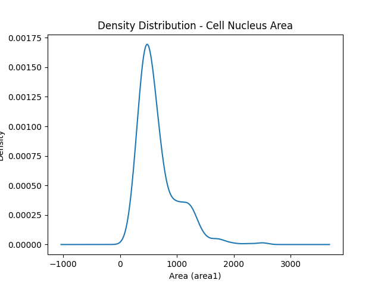
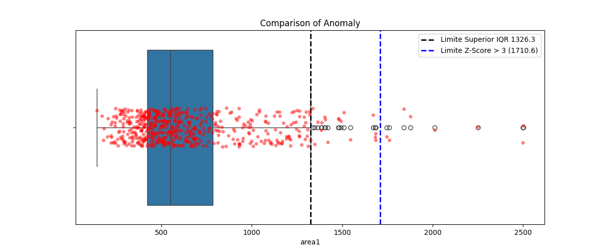
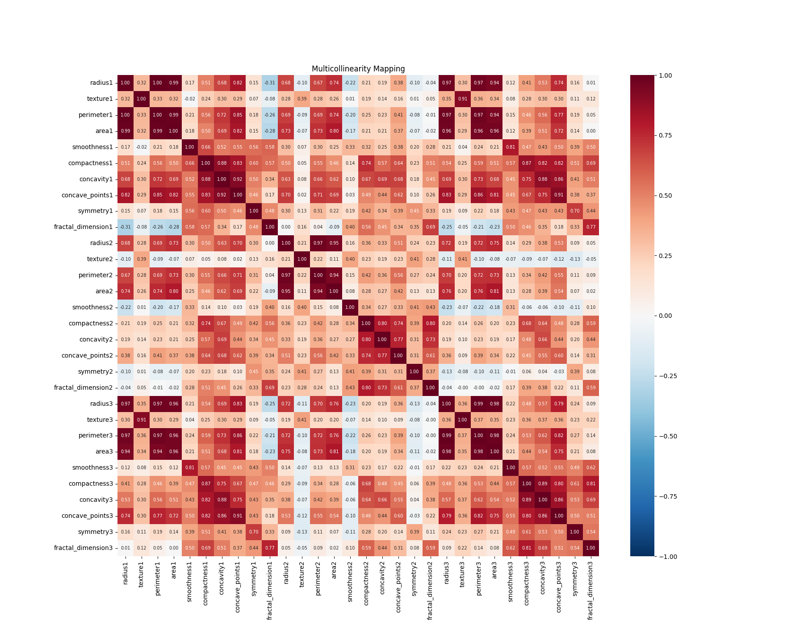

# Oxetech IA/ML

## Módulos Concluídos

### Módulo 1: Auditoria de Dados Clínicos e Justiça Algorítmica (data_analysis)

Esta atividade consistiu na auditoria estatística da base histórica "Breast Cancer Wisconsin (Diagnostic)" da UCI, atuando no papel de um Engenheiro de Dados. O foco não foi o treinamento de modelos preditivos, mas sim o diagnóstico da saúde estatística dos dados, identificação de anomalias biológicas e mapeamento de redundâncias informacionais.

#### Galeria de Resultados (Artefatos Visuais)

##### 1. Diagnóstico de Assimetria


##### 2. Isolamento de Anomalias (Outliers)


##### 3. Mapa de Multicolinearidade


#### Insights Técnicos Extraídos do Terminal

- **Volumetria Inicial:** O dataset processado conta com 569 amostras e 31 colunas (30 características morfológicas + 1 variável alvo de diagnóstico).

- **Assimetria Biológica (Gráfico 1):** A área do núcleo celular (area1) apresenta forte assimetria positiva (Symmetry: 1.65), evidenciada pelo distanciamento entre a Média (~654.9) e a Mediana (551.1). Isso comprova uma cauda longa à direita provocada por deformações celulares severas.

- **Isolamento Não-Paramétrico (Gráfico 2):** Utilizando o Método de Tukey (Amplitude Interquartílica - IQR), o limite superior de corte robusto foi definido em 1326.3.

- **Prevalência Clínica:** A taxa de prevalência de tumores malignos dentro do grupo de outliers isolados foi de 100.0%. Isso valida empiricamente que núcleos celulares que ultrapassam essa barreira matemática possuem probabilidade absoluta de malignidade.

- **Mapeamento de Redundância (Gráfico 3):** O mapa de calor expõe forte colinearidade cruzada (correlação próxima a 1.00) entre as trinfas de variáveis físicas (raio, perímetro e área). Variáveis como radius1 e perimeter1 são candidatas ideais para descarte (feature selection), reduzindo a dimensionalidade sem perda de informação clínica.

## Como Executar o Projeto

### 1. Configure e ative seu Ambiente Virtual (venv):

```bash
python -m venv venv
```

#### No Windows:
```bash
venv\Scripts\activate
```

#### No Linux:
```bash
source venv/Scripts/activate
```

### 2. Instale as dependências exigidas:

```bash
pip install -r requirements.txt
```

### 3. Execute o script do módulo atual:

```bash
python data_analysis/src/struct_data.py
```